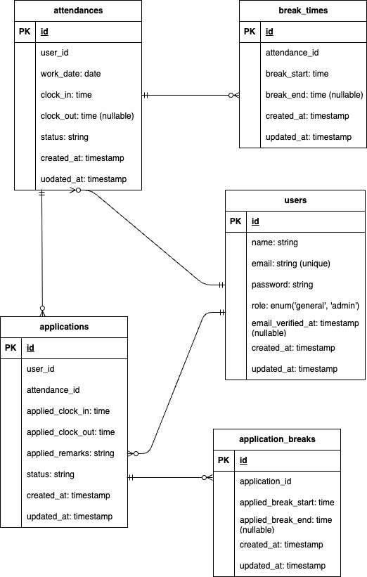

# coachtech 勤怠管理アプリ

## 環境構築

#### 1. Docker ビルド

```bash
git clone リンク
docker-compose up -d --build
```

\*MySQL は、OS によって起動しない場合があるのでそれぞれの PC に合わせて docker-compsoe.yml ファイルを編集してください。

#### 2. Laravel 環境構築

・composer のインストール

```bash
docker-compose exec php bash
composer install
```

#### 3. .env.example をコピーし.env ファイルを作成、環境変数の変更。

\*メールの設定について以下を参考にしてください

```.env
MAIL_MAILER=smtp
MAIL_HOST=mailhog
MAIL_PORT=1025
MAIL_USERNAME=null
MAIL_PASSWORD=null
MAIL_ENCRYPTION=null
MAIL_FROM_ADDRESS="test@example.com"
MAIL_FROM_NAME="CoachtechAttendanceManagement"
```

#### 4. アプリケーションキーの設定

```bash
php artisan key:generate

```

#### 5. マイグレーション、シーディングの実行

```bash
php artisan migrate
php artisan db:seed

```
#### ６. テスト環境の構築・実行
##### 本プロジェクトには Laravel の Feature / Unit テストが用意されています。
- 一般テストユーザ情報<br>
下記の情報でテスト用一般ユーザとしてでログインができます。<br>
email: test@example.com <br>
password: password<br>

- 管理者情報<br>
下記の情報で管理者としてログインできます<br>
email: Admin.1@example.com<br>
password: password123<br>

- テスト用DBの作成<br>
⇒mysqlコンテナに管理者としてログインしてテスト用DBの作成
```
CREATE DATABASE laravel_test_db;
```
- config/database.phpの変更<br>
・ 作成したデータベースに合わせた設定項目を記述
- テスト用.envファイル作成
```bash
cp .env .env.testing
```
- .env.testingファイルの環境変数の変更<br>
<設定項目><br>
APP_ENV<br>
APP_KEY<br>
DB_DATABASE<br>
DB_USERNAME<br>
DB_PASSWORD<br>

- config/database.phpで接続設定

- テスト用アプリケーションキーの作成
```bash
php artisan key:generate --env=testing
```
- マイグレーション実行
```bash
php artisan migrate --env=testing
```
- テストの実行
```bash
php artisan test
```

## 使用技術

フレームワーク：Laravel 8.7<br>
言語：PHP 8.1<br>
データベース：MySQL 8.0<br>
Web サーバー：Nginx 1.21.1<br>
管理ツール：phpMyAdmin<br>
仮想メールツール : mailhog<br>
実行環境：Docker（docker-compose v2.38.2）<br>

## ER 図



## URL

- phpMyAdmin : http://localhost:8080/
- mailhog Web_UI : http://localhost:8025/
- 勤怠登録画面（一般トップページ）: http://localhost/attendance
- 勤怠一覧画面（管理者トップ）： http://localhost/admin/attendances
- 会員登録画面 : http://localhost/register
- ログイン画面 : http://localhost/login
